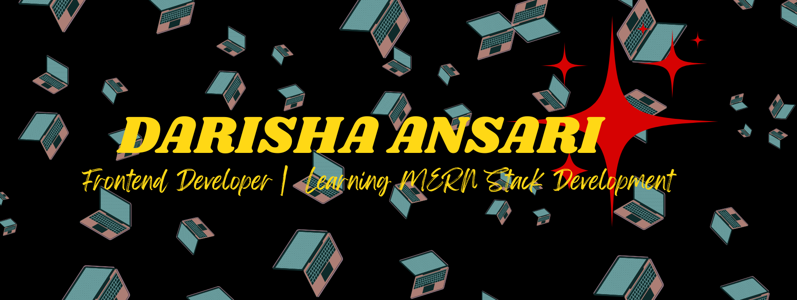

<h1 align="center">
   
  Hi, I'm Darisha Ansari!
</h1>

  

---

## 🚀 About Me

<table>
  <tr>
    <td width="60%">
      👩🏻‍💻 A passionate Frontend Developer | Lifelong Learner | Exploring MERN Stack Development
      
      🎓 Currently on a productive gap year after completing Intermediate. I'm actively pursuing my MERN Stack Development journey through **Jawan Pakistan**.  
      ✅ Completed **Module A**, now enrolled in **Module B**.
      
      🔍 I love building beautiful user interfaces, exploring new tech, and solving real-world problems through code.
      
      📚 I'm always learning, always improving — whether it's new frontend frameworks or backend logic!
    </td>
    <td width="40%" align="center">
        <video width="100%" controls>
          <source src="about.mp4" type="video/mp4">
          Your browser does not support the video tag.
        </video>
         
        <strong>🎬 My Short Introduction</strong>
    </td>
  </tr>
</table>

---

## 🎯 Currently Learning & Goals

✨ Currently diving deep into:

- ⚙️ **Advanced JavaScript** – mastering ES6+, closures, promises, and async/await
- 🛠️ **Backend with Node.js & Express**
- ⚛️ **React & React Native** for building scalable frontend and mobile apps
- 🔗 Integrating APIs, real-time databases (Firebase), and auth flows

🚧 Building a strong portfolio of projects and working on freelance client work.  
🎯 **Goal:** To become a confident MERN Stack Developer, contribute to open-source, and get hired remotely or freelance globally 🚀

---

## 💻 Web Development Projects

### 🔍 GitHub User Finder App  
Explore any GitHub user's profile using GitHub API.  

### ❓ Quiz App  
An interactive JavaScript-based quiz built for learning and fun.  

### 🏫 Client Website – SRC (Sir Rehan’s Collegiate)  
A dynamic one-page educational website built as a real client project.  

### 🏨 Luxury Hotel Clone  
Frontend design project developed in a hackathon challenge.  

---

## 💼 Experience

### 🧑‍💻 Frontend Development Intern – EFLEX Software House (Remote)
- 👩‍💻 Collaborated remotely in a real-world development team  
- 🚀 Gained hands-on experience with Git, communication tools, and Agile methods  
- 💻 Built responsive UI with HTML/CSS/JS for internal tools and client-facing apps  
- 🧠 Learned about project planning, team dynamics, and client feedback loops

---

## 🧰 Languages & Tools

   

---

## 📈 GitHub Stats

  

  

---

## 📬 Let's Connect

  

---

🚀 *Always excited to grow, build, and collaborate on meaningful projects!*
